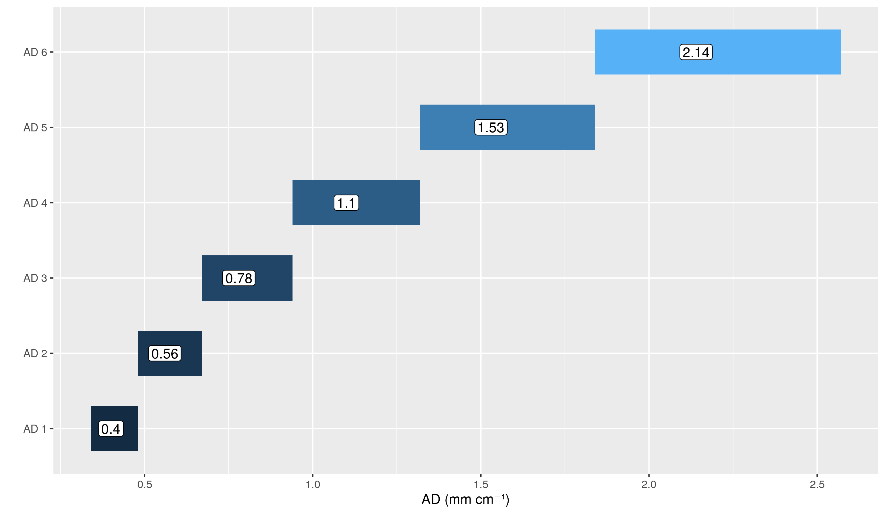
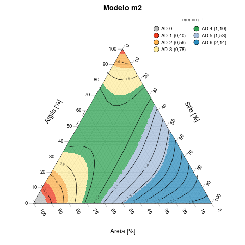
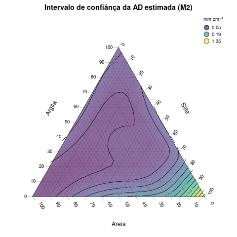

# Função de Pedotransferência ZARC

Nesse repositório estão os scripts R utilizados para gerar a função de pedotransferêcia (PTF) a ser utilizada pelo Zoneamento Agrícola de Risco Climático (ZARC).

A descrição detalhada do trabalho pode ser encontrada na publicação:

<citação do trabalho>

Adicionalmente, estão incluídos os scripts para gerar as figuras encontradas na publicação citada acima.

Todos os scripts foram desenvolvidos na liguagem `R`, utilizando projeto da IDE `RStudio`. Os seguintes pacotes adicionais são necessários:

 * `MASS`
 * `Ternary`
 * `Tidyverse`

Os scripts estão organizados na seguinte estrutura de pastas e arquivos:

* *dados* - pasta com os dados primários utilizados
   * *bd_zarc.csv* - base de dados com amostras de AD
   * *bd_independente.csv* - base de dados independente, com amostras de AD cedidas por Dr. Eduardo Guimarães Couto (UFMT - Cuiabá), Dr. Jean Dalmo de Oliveira Marques (IFAM - Manaus) e Joberta Cardoso Pastana Yakuwa (mestranda da UFRA)
   * *sensibilidade_risco_cad_csv* - dados da variação do risco agrícola em relação à CAD
* *figs* - pasta com os gráficos gerados pelos scripts e utilizados na publicação
* *resultados* - pasta com os resultados gerados pelos scripts
   * *Preditos_triangulo_AD_m1.csv* - AD predita e intervalo de confiança p/ o triangulo textural por M1 (n = 5151)
   * *Preditos_triangulo_AD_m2.csv* - AD predita e intervalo de confiança p/ o triangulo textural por M2 (n = 5151)
   * *PTF_ZARC_m1_ms.csv* - Dados preditos por M1 e M2 para o BD-Zarc (n = 1021)
* *src* - pasta com os scripts R
   * *estatistica_descritiva_bd_zarc.R* - Análise da BD-Zarc, usado para gerar gráficos de densidade, boxplots e representação no gráfico ternário. Inclui gráficos descrevendo resultado do modelo M2
   * *estatistica_descritiva_base_independente.R* - Análise da BD-Independente, usado para gerar gráficos de densidade, boxplots e representação no gráfico ternário
   * *outras_PTFs.R* - scripts com outras PTFs usadas para a comparação
   * *grupo_subgrupo_textural.R* - funções para retornar o grupo / subgrupo textural do SiBCS de uma amostra
   * *sensibilidade_risco_ad.r* - Script para avaliar a sensibilidade do risco à AD e avaliar a divisão das novas classes de AD
   * *PTF_AD_MIXTURE.R* - Script para calibração da PTF, modelos M1 e M2. Incluí gráficos ternários e análise do modelo gerado
   * *validacao_cruzada_m1_m2.R* - validação cruzada dos modelos m1 e m2
   * *validacao_cruzada_e_compara_PTFs.Rmd* - Notebook para fazer a validação cruzada e comparação do resultado do M2 com outras PTFs da literatura. Originalmente foi escrito na forma de um Notebook. Decidido manter nesse formato.
   
### Principais resultados

Como principais resultados podemos citar:

1. PTF para estimativa da AD a partir das frações Areia Total, Silte e Argila (`src/PTF_AD_MIXTURE.R`)
2. Novas classes de AD para o ZARC (`src/sensibilidade_risco_ad.R`)  
{width=500px}
3. Triângulo textural com as novas classes de AD  

4. Intervalo de confiânça das estimativas de AD no triângulo  

